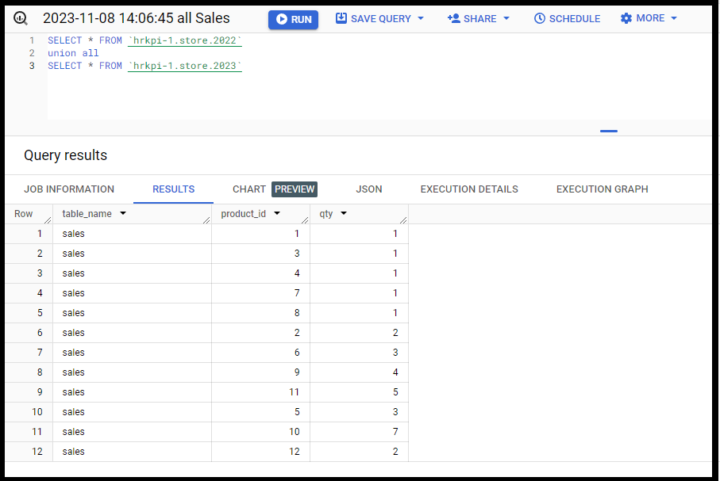

# طريقة استخدام Union All 

نستخدم union all عند الرغبة في دمج جدولين أو اكثر


هنا مثال لجداول المبيعات لسنة 2022 وسنة 2023 نرغب بجمعها


### جدول 2022
 لتحميل البيانات [2022.csv](/./2022.csv)

| **table_name** | **product_id** | **qty** |
|:--------------:|:--------------:|:-------:|
| sales          | 1              | 1       |
| sales          | 2              | 2       |
| sales          | 3              | 1       |
| sales          | 4              | 1       |
| sales          | 6              | 3       |
| sales          | 7              | 1       |
| sales          | 8              | 1       |
| sales          | 9              | 4       |
| sales          | 11             | 5       |

نلاحظ أن عدد الصفوف 9 فقط


-----------------------------------------

###  جدول 2023

 لتحميل البيانات [2023.csv](/./2023.csv)

| **table_name** | **product_id** | **qty** |
|:--------------:|:--------------:|:-------:|
| sales          | 5              | 3       |
| sales          | 10             | 7       |
| sales          | 12             | 2       |

نلاحظ أن عدد الصفوف 3 فقط


**نقوم بتنفيذ هذا الأستعلام**

``````
SELECT * FROM `hrkpi-1.store.2022` 
union all
SELECT * FROM `hrkpi-1.store.2023` 
``````

* hrkpi-1.store.2022: اسم الجدول لسنة `2022`
* hrkpi-1.store.2023: اسم الجدول لسنة `2023`


### النتيجة

| **table_name** | **product_id** | **qty** |
|:--------------:|:--------------:|:-------:|
| sales          | 1              | 1       |
| sales          | 3              | 1       |
| sales          | 4              | 1       |
| sales          | 7              | 1       |
| sales          | 8              | 1       |
| sales          | 2              | 2       |
| sales          | 6              | 3       |
| sales          | 9              | 4       |
| sales          | 11             | 5       |
| sales          | 5              | 3       |
| sales          | 10             | 7       |
| sales          | 12             | 2       |

نلاحظ أن عدد الصفوف 12 صف 
تم جمع الجدولين في جدول واحد 


> **Note**
> أحفظ النتيجة كجدول جديد بأسم `all.csv`
>
> وبعدها يمكنك استخدام وتحليل البيانات لجميع السنوات مرة واحدة



